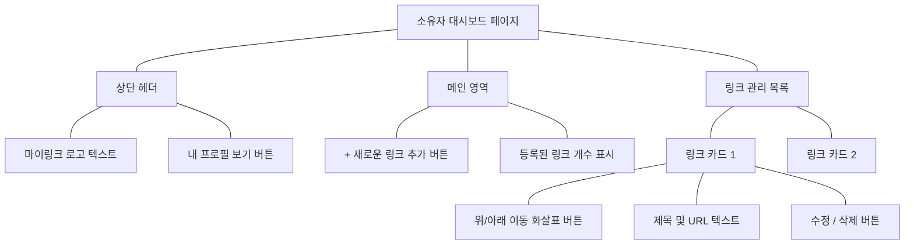

# MyLink (마이링크) - 와이어프레임 (Wireframes)

## 1. 퍼블릭 프로필 페이지 (`/u/[username]`) 와이어프레임

해당 페이지는 방문자가 모바일 기기로 접속했을 때를 기준으로 작성된 화면 구조입니다.

### 1.1 ASCII 아트 와이어프레임
```text
+--------------------------------------------------+
|                                                  |
|                                       [공유하기] |
|                                                  |
|                  +---------+                     |
|                  |  (o o)  |                     |
|                  |   \~/   |                     |
|                  +---------+                     |
|                                                  |
|                 @username                        |
|                                                  |
|     안녕하세요! 제 이력을 한곳에 모아두었습니다. |
|     아래 링크들을 확인해 주세요!                 |
|                                                  |
|  +--------------------------------------------+  |
|  |                 GitHub                     |  |
|  +--------------------------------------------+  |
|                                                  |
|  +--------------------------------------------+  |
|  |               Tech Blog                    |  |
|  +--------------------------------------------+  |
|                                                  |
|  +--------------------------------------------+  |
|  |               LinkedIn                     |  |
|  +--------------------------------------------+  |
|                                                  |
|                                                  |
|              Powered by MyLink                   |
|                                                  |
+--------------------------------------------------+
```

### 1.2 Mermaid UI 컴포넌트 구조도 (DOM 트리 형태)
```mermaid
graph TD
    Root[퍼블릭 프로필 페이지]
    
    Root --- TopBar[상단 영역]
    TopBar --- Share[공유하기 버튼]
    
    Root --- Profile[프로필 영역]
    Profile --- Avatar((프로필 이미지))
    Profile --- Username[@username]
    Profile --- Bio[소개글]
    
    Root --- LinkList[링크 목록 영역 - 세로 정렬]
    LinkList --- Link1[링크 버튼 1]
    LinkList --- Link2[링크 버튼 2]
    LinkList --- LinkN[링크 버튼 N ...]
    
    Root --- Footer[하단 영역]
    Footer --- Branding[Powered by MyLink 브랜딩]
```

---

## 2. 소유자 대시보드 (`/dashboard`) 와이어프레임

링크를 추가하고 순서를 관리하는 관리자 화면 구조입니다. (아이콘 없이 텍스트 중심으로 설계되었습니다.)

### 2.1 ASCII 아트 와이어프레임
```text
+--------------------------------------------------+
|  [MyLink]                          [내 프로필 보기] |
+--------------------------------------------------+
|                                                  |
|                    대시보드                        |
|                                                  |
|  +--------------------------------------------+  |
|  |           [ + 새로운 링크 추가 ]             |  |
|  +--------------------------------------------+  |
|                                                  |
|  등록된 링크 (2/30)                               |
|                                                  |
|  +--------------------------------------------+  |
|  | [▲]  [▼]     GitHub                        |  |
|  |              https://github.com/kim        |  |
|  |                                            |  |
|  |                          [수정]   [삭제]   |  |
|  +--------------------------------------------+  |
|                                                  |
|  +--------------------------------------------+  |
|  | [▲]  [▼]     Tech Blog                     |  |
|  |              https://blog.com              |  |
|  |                                            |  |
|  |                          [수정]   [삭제]   |  |
|  +--------------------------------------------+  |
|                                                  |
+--------------------------------------------------+
```

### 2.2 Mermaid UI 컴포넌트 구조도 (DOM 트리 형태)

